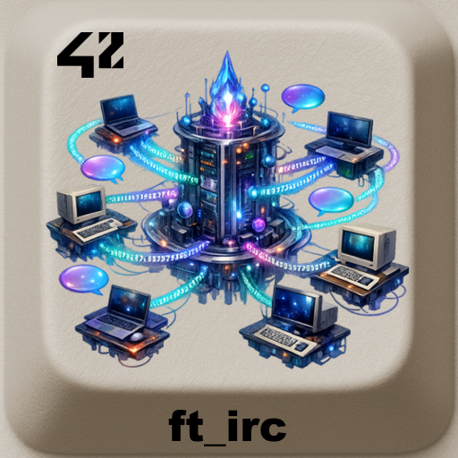

<div align="center">
  <h2>ft_irc – 42 project IRC Server</h2>
  
  <br>
</div>


> **ft_irc** is a fully functional **IRC server** written in **C++98**, compliant with the IRC protocol specifications.

---

## 📖 Table of Contents
- [Description](#-description)
- [Features](#-features)
- [Installation](#-installation)
- [Usage](#-usage)
- [Supported Commands](#-supported-commands)
- [Project Structure](#-project-structure)
- [Roadmap](#-roadmap)
- [Credits](#-credits)
- [License](#-license)

---

## 📝 Description
The goal of this project is to implement a **multi-client IRC server** from scratch.  
It focuses on:

- TCP/IP networking (IPV4)
- Poll-based multiplexing
- Client authentication
- Channel and user management
- Strict protocol parsing

---

## ✨ Features
- ✅ Multiple clients simultaneously.
- ✅ Authentication with password.
- ✅ Nickname and username management.
- ✅ Channel creation and moderation.
- ✅ Private and channel messaging.
- ✅ Operator privileges.
- ✅ Robust error handling.

---

## ⚙️ Installation
Requirements:
- Linux or macOS
- `c++` compiler with C++98 support
- `make`

Clone and compile:
```bash
git clone https://github.com/LogUmi/ft_irc.git
cd ft_irc
make
```

---

## 🖥 Usage
### Run the server:
```bash
./ircserv <port> <password>
```

### Connect using an IRC client:
```bash
nc localhost <port>
PASS mypassword
NICK mynickname
USER myuser 0 * :Real Name
```

This version was built using also LimeChat (MacOs).

---

## ⌨️ Supported Commands
- CAP (minimalist)
- INVITE
- JOIN
- KICK
- MODE
- NICK
- NOTICE
- PART
- PASS
- PRIVMSG
- PING
- PONG
- QUIT
- TOPIC
- USER

---

## 📂 Project Structure
```
.
├── inc/
│    ├── Channel.hpp
│    ├── Commands.hpp
│    ├── Parser.hpp
│    ├── Server.hpp
│    └──User.hpp
├── src/
│    ├── Channel.cpp
│    ├── Commands.cpp
│    ├── main.cpp
│    ├── Parser.cpp
│    ├── Server.cpp
│    └── User.cpp
├── en.subject.pdf
├── LICENSE
├── Makefile
├── README.md
└── README42.md

```

---

## 🚀 Roadmap
This project represents the final validated version for the 42 curriculum.

---

## 👤 Credits
Project developed by:
- **Loïc Gérard** – 📧 lgerard@student.42perpignan.fr  
  [École 42 Perpignan](https://42perpignan.fr)
(https://42perpignan.fr).
- **WolfyNours**  - (https://github.com/WolfyNours).
- **notoverflow** - (https://github.com/notoverflow).

---

## 📜 License
This project is released under the MIT License.

> ⚠️ **Note for students**  
> If you are a student at 42 (or elsewhere), it is strongly recommended **not to copy/paste** this code.  
> Instead, try to **write your own solution** — it’s the only way to really learn and succeed.
